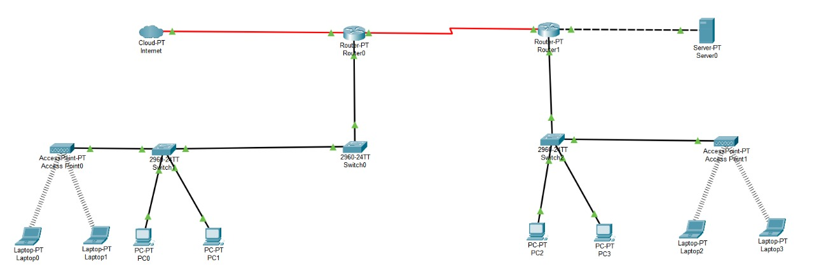

# 📘 SOAL EVALUASI — Media Jaringan & Pengkabelan

Repository ini berisi soal evaluasi mengenai media jaringan, jenis kabel jaringan, fiber optik, dan implementasi topologi menggunakan Cisco Packet Tracer.

---

# 📝 Daftar Soal

## 1️⃣ Tahapan Pembuatan Kabel

Jelaskan kembali tahapan pembuatan:

- Kabel **Straight Through**
- Kabel **Crossover**

Penjelasan minimal mencakup:

- Alat dan bahan
- Susunan warna kabel
- Langkah crimping
- Fungsi masing-masing kabel

---

## 2️⃣ Perbedaan Kabel CAT

Jelaskan perbedaan teknologi kabel:

- CAT1
- CAT2
- CAT3
- CAT4
- CAT5
- CAT5e
- CAT6
- CAT6a
- CAT7

Penjelasan minimal mencakup:

- Kecepatan transfer data
- Bandwidth
- Fungsi/penggunaan
- Perbedaan kualitas
- Perkembangan teknologi

---

## 3️⃣ Implementasi Topologi Cisco Packet Tracer

Hubungkan perangkat pada gambar topologi berikut menggunakan:

  

---

### 📌 Tugas

1. Buat kembali topologi pada Cisco Packet Tracer
2. Hubungkan seluruh perangkat sesuai topologi
3. Jelaskan jenis kabel yang digunakan untuk setiap koneksi perangkat

---

# 📡 Penjelasan Kabel pada Topologi

Mahasiswa wajib menjelaskan:

| Perangkat yang Dihubungkan | Jenis Kabel | Alasan Penggunaan |
|----------------------------|-------------|-------------------|
| PC ↔ Switch | ? | ? |
| Switch ↔ Router | ? | ? |
| Switch ↔ Switch | ? | ? |
| Router ↔ Router | ? | ? |

---

# 📎 Ketentuan Tambahan

- Gunakan jenis kabel yang sesuai standar jaringan
- Jelaskan fungsi kabel yang digunakan
- Sertakan screenshot hasil topologi jika diminta

---

## 4️⃣ Struktur Kabel Fiber Optik

Jelaskan struktur dasar kabel fiber optik beserta fungsi masing-masing bagiannya.

Minimal mencakup:

- Core
- Cladding
- Coating/Buffer
- Strength Member
- Outer Jacket

---

### 📌 Pertanyaan Tambahan

Bagaimana struktur kabel fiber optik mempengaruhi kemampuan kabel dalam mentransmisikan data?

---

## 5️⃣ Tahapan Crimping Fiber Optik

Jelaskan proses dan tahapan:

# 🔧 Crimping Kabel Fiber Optik

Minimal mencakup:

- Persiapan alat dan bahan
- Pengupasan kabel
- Cleaving
- Penyambungan
- Pemasangan konektor
- Pengujian koneksi

---

## 6️⃣ Kelebihan dan Kekurangan Fiber Optik

Jelaskan:

# ✅ Kelebihan Fiber Optik

Contoh:

- Kecepatan tinggi
- Bandwidth besar
- Tahan interferensi

---

# ❌ Kekurangan Fiber Optik

Contoh:

- Biaya mahal
- Instalasi rumit
- Kabel lebih sensitif

---

# 🎯 Tujuan Evaluasi

Mahasiswa diharapkan mampu:

- Memahami jenis kabel jaringan
- Memahami teknik crimping
- Mengimplementasikan topologi jaringan
- Memahami media transmisi fiber optik
- Menentukan penggunaan kabel sesuai kebutuhan jaringan

---

# 📚 Materi Terkait

- Kabel Straight Through
- Kabel Crossover
- UTP/STP
- Fiber Optik
- Crimping
- Cisco Packet Tracer
- Topologi Jaringan
- Media Transmisi

---

# ⚠️ Catatan

- Gunakan Cisco Packet Tracer versi **8.2.2**
- Perhatikan jenis kabel saat menghubungkan perangkat
- Pastikan topologi dapat berjalan dengan baik
- Simpan file simulasi dengan format `.pkt`

---